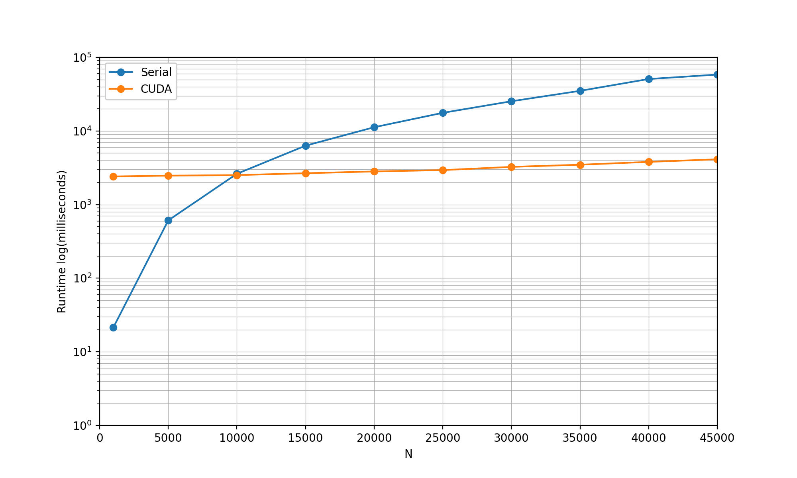

# Design

This file documents the design and implementation of the [matrix normalization](http://en.wikipedia.org/wiki/Standard_score) algorithm using the NVIDIA® [CUDA®](https://developer.nvidia.com/cuda-toolkit) toolkit.

## Background

The objective of this task is to normalize columns of a matrix $A$ of size $N\times N$ using standard score normalization. For column $X$ of $A$, the score $z$ of row value $x$ can be calculated by the equation

```math
z = \frac{x-\mu}{\sigma}
```

where $\mu$ is the arithmetic mean of the column

```math
\mu = \frac{1}{N}\sum_{i=1}^{N}x_i
```

and $\sigma$ is the standard deviation

```math
\sigma = \sqrt{\frac{1}{N}\sum_{i=1}^{N}(x_i-\mu)^2}
```

## Compute Environment

The compute environment for this exercise was hosted on [Chameleon Cloud](https://www.chameleoncloud.org/) on a single compute node with GPU capabilities. This physical hardware for this node consisted of two AMD [EPYC™ 7763](https://www.amd.com/en/products/cpu/amd-epyc-7763) CPUs and one NVIDIA® [A100 Tensor Core GPU](https://www.nvidia.com/en-us/data-center/a100/).

The compute node hosted a baremetal instance of [Ubuntu 20.04](https://releases.ubuntu.com/focal/) with NVIDIA® [CUDA® Toolkit](https://developer.nvidia.com/cuda-toolkit) preinstalled. Using the command `nvcc --version` we can confirm that the system is running CUDA 12.2.

```bash
$ nvcc --version
nvcc: NVIDIA (R) Cuda compiler driver
Copyright (c) 2005-2023 NVIDIA Corporation
Built on Tue_Jul_11_02:20:44_PDT_2023
Cuda compilation tools, release 12.2, V12.2.128
Build cuda_12.2.r12.2/compiler.33053471_0
```

Further information about the GPU of this compute node can be obtained using the CUDA utility `deviceQuery`

```bash
cc@chameleon-cloud:/cuda-12.2/extras/demo_suite/$ ./deviceQuery
./deviceQuery Starting...

 CUDA Device Query (Runtime API) version (CUDART static linking)

Detected 1 CUDA Capable device(s)

Device 0: "NVIDIA A100-PCIE-40GB"
  CUDA Driver Version / Runtime Version          12.2 / 12.2
  CUDA Capability Major/Minor version number:    8.0
  Total amount of global memory:                 40339 MBytes (42298834944 bytes)
  (108) Multiprocessors, ( 64) CUDA Cores/MP:     6912 CUDA Cores
  GPU Max Clock rate:                            1410 MHz (1.41 GHz)
  Memory Clock rate:                             1215 Mhz
  Memory Bus Width:                              5120-bit
  L2 Cache Size:                                 41943040 bytes
  Maximum Texture Dimension Size (x,y,z)         1D=(131072), 2D=(131072, 65536), 3D=(16384, 16384, 16384)
  Maximum Layered 1D Texture Size, (num) layers  1D=(32768), 2048 layers
  Maximum Layered 2D Texture Size, (num) layers  2D=(32768, 32768), 2048 layers
  Total amount of constant memory:               65536 bytes
  Total amount of shared memory per block:       49152 bytes
  Total number of registers available per block: 65536
  Warp size:                                     32
  Maximum number of threads per multiprocessor:  2048
  Maximum number of threads per block:           1024
  Max dimension size of a thread block (x,y,z): (1024, 1024, 64)
  Max dimension size of a grid size    (x,y,z): (2147483647, 65535, 65535)
  Maximum memory pitch:                          2147483647 bytes
  Texture alignment:                             512 bytes
  Concurrent copy and kernel execution:          Yes with 3 copy engine(s)
  Run time limit on kernels:                     No
  Integrated GPU sharing Host Memory:            No
  Support host page-locked memory mapping:       Yes
  Alignment requirement for Surfaces:            Yes
  Device has ECC support:                        Enabled
  Device supports Unified Addressing (UVA):      Yes
  Device supports Compute Preemption:            Yes
  Supports Cooperative Kernel Launch:            Yes
  Supports MultiDevice Co-op Kernel Launch:      Yes
  Device PCI Domain ID / Bus ID / location ID:   0 / 151 / 0
  Compute Mode:
     < Default (multiple host threads can use ::cudaSetDevice() with device simultaneously) >

deviceQuery, CUDA Driver = CUDART, CUDA Driver Version = 12.2, CUDA Runtime Version = 12.2, NumDevs = 1, Device0 = NVIDIA A100-PCIE-40GB
Result = PASS
```

## Design

The provided serial source code contains the function `matrixNorm()` that encompasses the three necessary components of the matrix normalization algorithm.

```c
void matrixNorm() {
    int row, col;
    float mu, sigma; 
    
    printf("Computing Serially.\n");
    
    for (col=0; col < N; col++) {
        mu = 0.0;
        for (row=0; row < N; row++)
            mu += A[row][col];
        mu /= (float) N;
        sigma = 0.0;
        for (row=0; row < N; row++)
            sigma += powf(A[row][col] - mu, 2.0);
        sigma /= (float) N;
        sigma = sqrt(sigma);
        for (row=0; row < N; row++) {
            if (sigma == 0.0)
                B[row][col] = 0.0;
            else
                B[row][col] = (A[row][col] - mu) / sigma;
        }
    }
}
```

For each column, the arithmetic mean `mu` and standard deviation `sigma` are calculated, and are then used to compute the standardized score for each element. These scores are then written to the output matrix `B`, concluding the algorithm.

### Data Structure and Movement

As opposed to the serial code, the design of the CUDA implementation utilizes one-dimensional, dynamically allocated structures for the host copies of `h_A` and `h_B`.

```c
h_A = (float *)malloc(N*N * sizeof(float));
h_B = (float *)malloc(N*N * sizeof(float));
```
where the size of the arrays (`N*N`) are indeed the same size as the two-dimensional arrays from the source code.

The reason for this design choice was to make use of the CUDA API `cudaMalloc()`, which similarly allocates a portion of linear memory on the device.

```c
float *d_A, *d_B;
cudaMalloc(&d_A, N * N * sizeof(float));
cudaMalloc(&d_B, N * N * sizeof(float));
```

Prior to the algorithm, the initialized copy of `h_A` is copied ot the device using the CUDA API `cudaMemcpy()`

```c
cudaMemcpy(d_A, h_A, N * N * sizeof(float), cudaMemcpyHostToDevice);
```

and following matrix normalization, the computed values of `d_B` are copied back to the host.

```c
cudaMemcpy(h_B, d_B, N * N* sizeof(float), cudaMemcpyDeviceToHost);
```

### Kernel Function

The CUDA Kernel `matrix_norm()` was designed in such a way that an individual thread computes one column of `d_A`.


```cpp
__global__ void matrix_norm(const float *A, float *B, int N)
{
    int row;
    float mu, sigma;
    int idx = blockIdx.x * blockDim.x + threadIdx.x;
    if (idx < N)
    {
        mu = 0.0;
        for (row = 0; row < N; row++)
            mu += A[idx + row * N];
        mu /= (float) N;

        sigma = 0.0;
        for (row = 0; row < N; row++)
            sigma += powf(A[idx + row * N] - mu, 2.0);
        sigma /= (float) N;
        sigma = sqrt(sigma);

        for (row = 0; row < N; row++)
        {
            if (sigma == 0.0)
                B[idx + row * N] = 0.0;
            else
                B[idx + row * N] = (A[idx + row * N] - mu) / sigma;
        }
    }
}
```
The built-in variables `blockIdx`, `blockDim`, and `threadIdx` are used to compute the one-dimensional thread id `idx`. This id is used to index and schedule the columns of `d_A` that each thread is working on.

The indexing schema `[idx + row * N]` serves the purpose of indexing through the one-dimensional array in a **two-dimensional** fashion.

```c
for (row = 0; row < N; row++)
    A[idx + row * N] + some loop-independent operation on A
```
For example, for the first thread with thread id `idx = 0`, computations begin on the first element of `d_A`. The term `row * N` allows for accessing subsequent rows of the first column, indexing across the one-dimensional memory layout with a stride of `N`.

In the event that more threads are allocated than the workload `N`, the conditional `if (idx < N)` prevents unwanted behavior such as out-of-bounds memory access. Within this conditional statement is where the operations of the matrix normalization algorithm are executed. These operations are identical to the serial source with the exclusion of how the matrices are indexed.

### Launch Configuration

The CUDA program requires kernel launch configuration parameters for grid size and block size of the kernel. Block size can be specified at runtime, but if no parameters are passed the program defaults to a default `block_size = 32`.

```c
    if (block_size == 0)
    {
        block_size = 32;
    }

    grid_size = (int) ceil(N + block_size - 1) / block_size;
```

The `grid_size` calculation makes use of the `ceil()` function to ensure that if `N` is not evenly divisible by `block_size`, the program will still allocate enough threads to cover the workload. For the sake of debugging and documentation, these parameters are printed out at runtime as well.

With these parameters specified, the kernel is launched using the standard CUDA syntax

```c
matrix_norm<<<grid_size, block_size>>>(d_A, d_B, N);
cudaDeviceSynchronize();

cudaMemcpy(h_B, d_B, N * N* sizeof(float), cudaMemcpyDeviceToHost);
```
and the API `cudaDeviceSychronize()` is called after launch to ensure that the algorithm is complete before the host receives the device's copy of `d_B`.

### Accuracy Verification

In addition to the development of the CUDA program `matrixNormCUDA.cu`, a complimentary serial program `matrixNormSerial.c` whose structure is identical to the CUDA program, and mathematically identical to the source code. Both programs are configurable at execution, with the option to specify the random seed to verify that both programs produce identical results.

The serial program is executed by specifying the workload size and random seed

```bash
./matrixNormSerial.out
Random seed = 2

Initializing...

---------------------------------------------
Matrix size N = 10

Starting clock.

45939.19	53062.95	 5819.30	 7961.26	22826.63	27653.70	45862.45	 4350.56	38501.24	42137.44
64920.18	19380.19	17782.32	 4564.97	62235.57	25046.24	21149.13	64773.52	55215.53	18042.99
39100.52	36465.56	55568.50	12099.50	26048.58	58311.50	55737.10	20822.74	 6748.12	 2942.60
42270.14	52687.30	56005.55	48089.44	60648.57	13296.18	10207.14	40975.02	17646.74	48708.39
17576.46	17030.92	 2552.58	35358.78	21595.89	64788.14	60405.02	42745.02	64025.67	50084.54
60788.02	37590.19	21014.11	50820.51	49689.69	47062.68	43596.02	39890.79	 2349.42	50344.13
42833.39	44619.57	37495.44	33302.93	27173.01	32608.00	46599.11	37380.15	 8047.02	64245.86
20552.54	25623.48	15740.77	23105.12	60982.26	37336.67	22357.26	55851.27	14545.69	20846.93
40399.82	 9797.71	58437.12	61413.92	60618.22	42590.81	42940.61	38678.24	16945.60	45290.03
23486.37	59778.98	24373.60	60981.81	27545.92	51546.60	28053.81	 8609.03	23390.75	36100.84

Stopped clock.

Runtime = 0.185 ms.

    0.41	    1.07	   -1.18	   -1.27	   -1.11	   -0.82	    0.53	   -1.71	    0.69	    0.24
    1.67	   -1.00	   -0.59	   -1.44	    1.17	   -0.99	   -1.07	    1.62	    1.53	   -1.13
   -0.05	    0.05	    1.31	   -1.07	   -0.92	    1.21	    1.16	   -0.80	   -0.90	   -1.98
    0.17	    1.05	    1.33	    0.71	    1.08	   -1.77	   -1.77	    0.31	   -0.36	    0.62
   -1.48	   -1.14	   -1.35	    0.08	   -1.18	    1.64	    1.46	    0.40	    1.97	    0.69
    1.40	    0.12	   -0.42	    0.84	    0.45	    0.47	    0.38	    0.25	   -1.12	    0.71
    0.20	    0.55	    0.40	   -0.02	   -0.85	   -0.49	    0.57	    0.11	   -0.84	    1.50
   -1.28	   -0.61	   -0.69	   -0.53	    1.10	   -0.18	   -0.99	    1.13	   -0.51	   -0.97
    0.04	   -1.59	    1.45	    1.36	    1.08	    0.17	    0.34	    0.18	   -0.39	    0.42
   -1.09	    1.49	   -0.26	    1.34	   -0.83	    0.76	   -0.62	   -1.48	   -0.07	   -0.10

---------------------------------------------
```

and the CUDA program is executed the same way with the exception of additionally specifying the block size of the kernel before the random seed.

```bash
./matrixNormCUDA.out 10 5 2
Random seed = 2

Initializing...

---------------------------------------------
Matrix size N = 10

Starting clock.

45939.19	53062.95	 5819.30	 7961.26	22826.63	27653.70	45862.45	 4350.56	38501.24	42137.44
64920.18	19380.19	17782.32	 4564.97	62235.57	25046.24	21149.13	64773.52	55215.53	18042.99
39100.52	36465.56	55568.50	12099.50	26048.58	58311.50	55737.10	20822.74	 6748.12	 2942.60
42270.14	52687.30	56005.55	48089.44	60648.57	13296.18	10207.14	40975.02	17646.74	48708.39
17576.46	17030.92	 2552.58	35358.78	21595.89	64788.14	60405.02	42745.02	64025.67	50084.54
60788.02	37590.19	21014.11	50820.51	49689.69	47062.68	43596.02	39890.79	 2349.42	50344.13
42833.39	44619.57	37495.44	33302.93	27173.01	32608.00	46599.11	37380.15	 8047.02	64245.86
20552.54	25623.48	15740.77	23105.12	60982.26	37336.67	22357.26	55851.27	14545.69	20846.93
40399.82	 9797.71	58437.12	61413.92	60618.22	42590.81	42940.61	38678.24	16945.60	45290.03
23486.37	59778.98	24373.60	60981.81	27545.92	51546.60	28053.81	 8609.03	23390.75	36100.84

Kernel Launch Parameters:
-------------------------
Blocks:		2
Threads/Block:	5
Total threads:	10

Stopped clock.

Runtime = 2442.3 ms.

    0.41	    1.07	   -1.18	   -1.27	   -1.11	   -0.82	    0.53	   -1.71	    0.69	    0.24
    1.67	   -1.00	   -0.59	   -1.44	    1.17	   -0.99	   -1.07	    1.62	    1.53	   -1.13
   -0.05	    0.05	    1.31	   -1.07	   -0.92	    1.21	    1.16	   -0.80	   -0.90	   -1.98
    0.17	    1.05	    1.33	    0.71	    1.08	   -1.77	   -1.77	    0.31	   -0.36	    0.62
   -1.48	   -1.14	   -1.35	    0.08	   -1.18	    1.64	    1.46	    0.40	    1.97	    0.69
    1.40	    0.12	   -0.42	    0.84	    0.45	    0.47	    0.38	    0.25	   -1.12	    0.71
    0.20	    0.55	    0.40	   -0.02	   -0.85	   -0.49	    0.57	    0.11	   -0.84	    1.50
   -1.28	   -0.61	   -0.69	   -0.53	    1.10	   -0.18	   -0.99	    1.13	   -0.51	   -0.97
    0.04	   -1.59	    1.45	    1.36	    1.08	    0.17	    0.34	    0.18	   -0.39	    0.42
   -1.09	    1.49	   -0.26	    1.34	   -0.83	    0.76	   -0.62	   -1.48	   -0.07	   -0.10

---------------------------------------------
```

The output of both are indeed identical, and were verified by hand to ensure accuracy of the CUDA program.

## Experimental Results

The first metric collected was the execution times of the serial and CUDA programs for a workload `N` between 1,000 and 45,000. For the CUDA times, a default `block_size = 128` was used for all iterations.

| N       | 1,000    | 5,000    | 10,000   | 15,000   | 20,000   |
|---------|----------|----------|----------|----------|----------|
| Serial  | 21.417   | 609.833  | 2,620.18 | 6,309.36 | 11,241.1 |
| CUDA    | 2,410.11 | 2,472.18 | 2,514.72 | 2,665.84 | 2,819.01 |

| N       | 25,000   | 30,000   | 35,000   | 40,000   | 45,000   |
|---------|----------|----------|----------|----------|----------|
| Serial  | 17,641.2 | 25,322.5 | 35,084.7 | 50,801.6 | 58,350.1 |
| CUDA    | 2,940.57 | 3,251.93 | 3,479.73 | 3,801.64 | 4,123.1  |

From the results, the serial implementation exhibits an expected positive relationship with workload size `N`, ranging from 21 milliseconds to 58,000 milliseconds, almost a minute. On the other hand, the CUDA implementation was remarkably consistent, ranging between 2,400 and 4,100 milliseconds. Plotting these results the stark difference between these programs' runtimes are even more apparent.

<br>
<p align="center">
  
</p>
<br>

Further analysis at the low end of `N` suggests that the CUDA implementation exhibits approximately 2,400 milliseconds of computational overhead. Should that indeed be the case that means for the largest problem size of `N = 45000`, the CUDA program spent only 1,700 milliseconds on computation.

## Kernel Launch Optimization

A parameter that was not evaluated during the initial experimental results are the choice of kernel launch configuration arguments. From the GPU specifications obtained from the `deviceQuery` utility in Section 2, we see some pertinent properties of the A100 GPU.

|Property   |Value  |
|-----------|-----------|
|Multiprocessors|108|
|CUDA Cores/MP|64|
|Warp size|32|
|Maximum number of threads per multiprocessor|2048|
|Maximum number of threads per block|1024|

Documentation and best practices suggest that the optimal block size is a multiple of the GPU's warp size, and from the device properties the maximum number of threads per block is 1,024. Therefore, to evaluate the effects of launch configuration, number of grid size and block size configurations for a workload of `N = 45000` was evaluated for block sizes between 32 and 1,024.