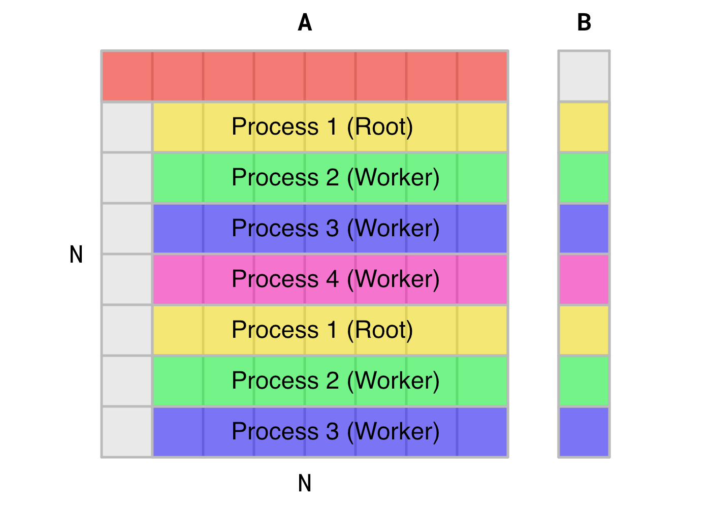

# Design

This document encompasses the design choices made to implement and optimize the Gaussian elimination parallel algorithm using Message Passing Interface (MPI). We will be using the [MPICH](https://www.mpich.org/) implementation and developing/testing on various Unix-like platforms.

## Design Intuition

As opposed to parallelization via `OpenMP` or `Pthreads`, the code structure and refactoring for an MPI program is far more explicit and requires a great deal of modification from source. While designing this program, a visualization of a small-scale example helped to gain some initial intuition for the implementation of MPI.

Suppose we wish to solve for matrix `A[8][8]` through Gaussian elimination. An MPI solution with four processes would therefore be initialized at `norm = 0` as illustrated in this figure:



In this figure, the first row of `A` and the first element of `B` are **not modified**, but are used to compute the new values of the updated subarea of `A`, and the remaining elements of `B`. Rows of `A` and `B` are computed via **static interleaving scheduling**, where the second row of `A` and the second element of `B` are computed by the root processor, followed by the three other worker processes. This process repeats for 7 (`N-1`) iterations until an upper-triangular matrix is obtained for `B`. This process is apparent in the following figure at the third (`norm = 2`) iteration of the algorithm.


## Code Structure

As opposed to parallelization via `OpenMP` of `Pthreads`, the code structure and refactoring for an MPI program is far more explicit and requires a great deal of modification from source. For example, here is the `main()` function of the MPI program, `gauss-mpi.c`:

```c
// Include MPI header file
#include <mpi.h>

int main(int argc, char *argv[])
{
    // Initialize MPI environment and num processes and rank
    MPI_Init(&argc, &argv);
    MPI_Comm_size(MPI_COMM_WORLD, &numprocs);
    MPI_Comm_rank( MPI_COMM_WORLD , &myid);

    // Initialize parameters, everyone gets N
    parameters(argc, argv);

    // Initialize inputs and Start Clock
    if (myid == 0)
    {
        initialize_inputs();
        printf("\nStarting clock.\n");
        start_time = MPI_Wtime();
    }

    // Compute Gaussian Elimination
    gauss_mpi();

    // Stop Clock and runtime logging
    if (myid == 0)
    {
        stop_time = MPI_Wtime();
        printf("Elapsed time = %f seconds\n", stop_time-start_time);
    }
    // Exit MPI environment
    MPI_Finalize();
    exit(0);
}

```

Let's do a rundown of `main()` comment-by-comment.

1. The header file `<mpi.h>` is included to tell the compiler to include the MPI header file.
2. The MPI environment is initialized using MPI routine `MPI_Init()`. We can then tell each process the number of processors in the environment, `numprocs`, and the rank of each individual process, `myid`.
3. Program parameters are derived from CLI arguments, and the size of the matrix `N` and seed for reproducibility `seed` are initialized.
4. Initialization of matrix `A` and column vectors `B` and `X` are performed by the root process. Additionally, the the routine `MPI_Wtime()` is called to obtain runtime.
5. The function `gauss_mpi()` is called. This is where the majority of iteration and design will occur.
6. Clock is stopped and elapsed time is displayed.
7. The MPI environment is closed and program exits.

## Design of `gauss_mpi()`
