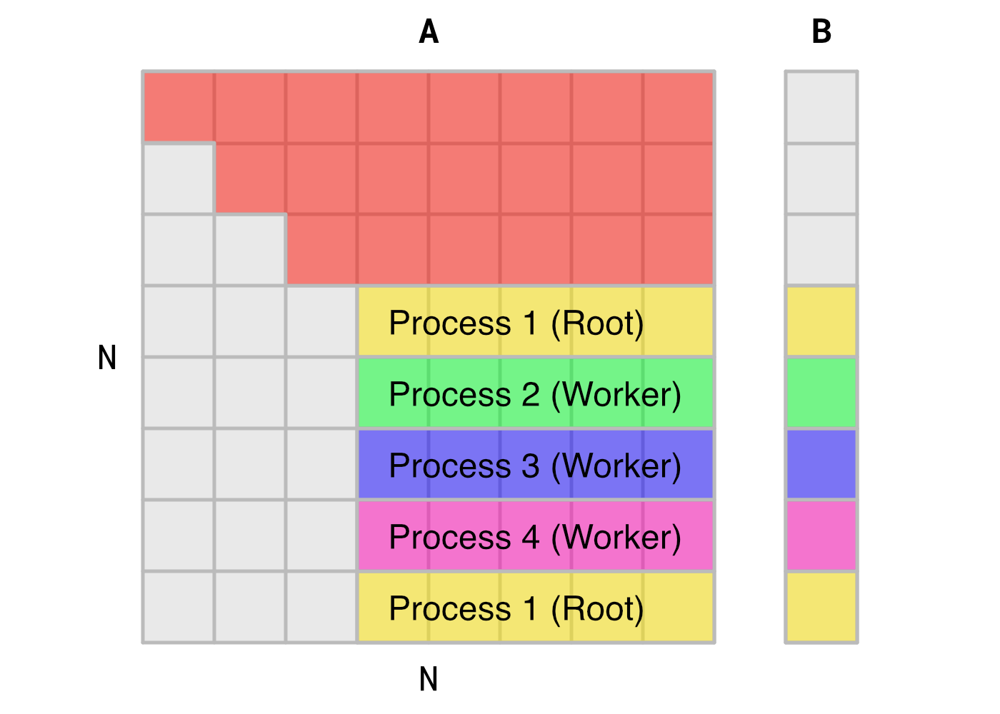

# Design

This document encompasses the design choices made to implement and optimize the Gaussian elimination parallel algorithm using Message Passing Interface (MPI). We will be using the [MPICH](https://www.mpich.org/) implementation and developing/testing on various Unix-like platforms. For information on the development and testing environment for this program, please see the `README` document.

## Algorithm Interpretation

As opposed to parallelization via `OpenMP` or `Pthreads`, the code structure and refactoring for an MPI program is far more explicit and requires a great deal of modification from source. While designing this program, a visualization of a small-scale example helped to gain some initial intuition for the implementation of MPI.

Suppose we wish to solve for matrix `A[8][8]` through Gaussian elimination. An MPI solution with four processes would therefore be initialized at `norm = 0` as illustrated in this figure:

<p align="center">

</p>


In this figure, the first row of `A` and the first element of `B` are **not modified**, but are used to compute the new values of the updated subarea of `A`, and the remaining elements of `B`. Rows of `A` and `B` are computed via **static interleaved scheduling**, where the second row of `A` and the second element of `B` are computed by the root processor, followed by the three other worker processes. Subsequent rows of the subarea are then assigned cyclically for each process, and computations of these rows are not dependent on one another, hence the application of parallelization and MPI.

The Gaussian elimination step repeats for 7 (`N-1`) iterations until an upper-triangular matrix is obtained for `A` and a corresponding updated `B`. This process is readily apparent in the following figure at the third (`norm = 2`) Gaussian elimination iteration:

<p align="center">

</p>

Note that static interleaved scheduling is still consistent on this iteration's subarea of `A`, and that the update computation on this subarea are contingent on the third row of `A`.

## Design Requirements

From the analysis of the Gaussian elimination step, we can determine the requirements of implementing MPI for each iteration of the algorithm.

More formally, for the $i^{th}$ iteration of the algorithm, the following items are required:

1. The root (rank 0) process stores the $(i-1)^{th}$ iteration of matrix `A` and vector `B`.
2. All processes must be scheduled via static interleaving.
3. The worker processes must have the same $(i-1)^{th}$ iteration of `A` and `B`, or at the very least the $(i-1)^{th}$ row of `A` and `B`, and rows that correspond to there scheduling.
4. Once all computations by the root and worker processes are completed, the local copy of `A` and `B` stored by the root process must be updated.
5. After completion of the Gaussian elimination step, the back substitution phase occurs. This phase exhibits $O(N^2)$ time complexity (as opposed to the previous phase's $O(N^3)$ time complexity), and can therefore be computed serially by the root process.

We can now begin matching these requirements to the appropriate MPI routines for robust and mathematically sound implementation.

## Program Logic and Candidate MPI Routines

1. The root process will initialize inputs `A` and `B` of the program, and subsequent MPI routine calls will be originate from root.
2. The root process will assign tasks to itself and the worker processes using static interleaved scheduling.
3. Each worker process must receive copies of `A` and `B`. This is an example of one-to-all communication, and the `MPI_Bcast()` routine is a potential candidate for this task. To send the rows that each worker process will compute, one-to-one communication in the form of the blocking `MPI_Send()` or non-blocking `MPI_Isend()` routines must be used.
4. While the root process can perform the Gaussian elimination computations independent of MPI communications, the worker processes must wait on communication of the updated data. Due to this dependency, the blocking routine `MPI_Recv()` will be used to receive the data. Once worker computations are complete, a `MPI_Send()` or `MPI_Isend` will be used to transmit the updated values back to the root process.
5. Upon completion of this step, the algorithm will transition to the back substitution phase. These phases will be separated by an `MPI_Barrier()` to ensure synchronization and completion of the first phase.

## Code Structure

Please note that code snippets outlined in the rest of this document are paraphrased or adapted from the MPI program `gauss-mpi.c. Please refer to the actual program for further clarification on code structure, logic, implementation of MPI, and additional functionality not discussed in this documentation.

### Program Parameters and Global Variables

As previously stated, extensive modification to the source code was necessary to implement MPI. The modified program begins with initial header files and program parameters Necessary for MPI.

```c
#include <mpi.h>

/* MPI variables */
int numprocs, myid;
double start_time, stop_time;
```

The program begins with the inclusion of the `<mpi.h>` header file, which is necessary for compiling with the MPICH compiler `mpicc`. Next, integer variables `numprocs` and `myid` are declared for indexing, identification, and scheduling purposes. The double variables `start_time` and `stop_time` are declared and are used in conjunction with the `MPI_Wtime()` routine to log runtime performance of the program.

## `main()` Function Structure

In addition to the main parallelization tasks associated with MPI, another auxiliary goal of this is to achieve functional parity with the the source code, i.e., both command line outputs are more or less identical. These goals are evident in the structure of the program's `main()` function.

```c
int main(int argc, char *argv[])
{   
    // Initialize MPI environment and num processes and rank
    MPI_Init(&argc, &argv);
    MPI_Comm_size(MPI_COMM_WORLD, &numprocs);
    MPI_Comm_rank(MPI_COMM_WORLD, &myid);

    // Initialize parameters, everyone gets N
    parameters(argc, argv);

    // Initialize inputs and Start Clock
    if (myid == 0)
    {
        initialize_inputs();
        print_inputs();
        printf("\nStarting clock.\n");
        start_time = MPI_Wtime();
    }

    // Compute Gaussian elimination
    gauss_mpi();

    // Stop Clock and runtime logging
    if (myid == 0)
    {
        stop_time = MPI_Wtime();
        printf("Stopped clock.\n");
        print_X();
        printf("\nElapsed time = %f seconds\n", stop_time - start_time);
        printf("--------------------------------------------\n");
    }

    // Exit MPI environment
    MPI_Finalize();
    exit(0);
}
```

The program begins by initializing the MPI environment using `MPI_Init()`. The routine `MPI_Comm_size()` is then used to obtain the total number of processes used by the program (specified at runtime from the CLI), and `MPI_Comm_rank()` is used to obtain the rank of each process running the program. These integer values are stored in `numprocs` and `myid` respectively.

Job size `N` and optional random seed are initialized using the `parameters()` function, and are specified at runtime. These actions are trivial in terms of time complexity and as such are completed by each process, with the additional bonus of transmitting the global variable `N` to each process. 

