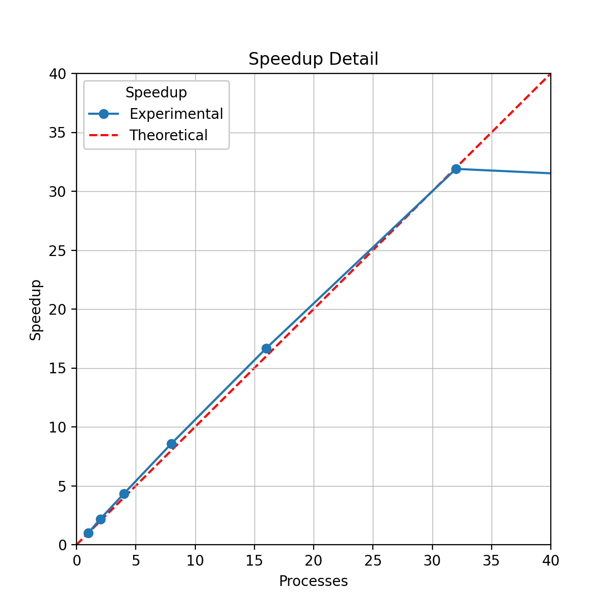
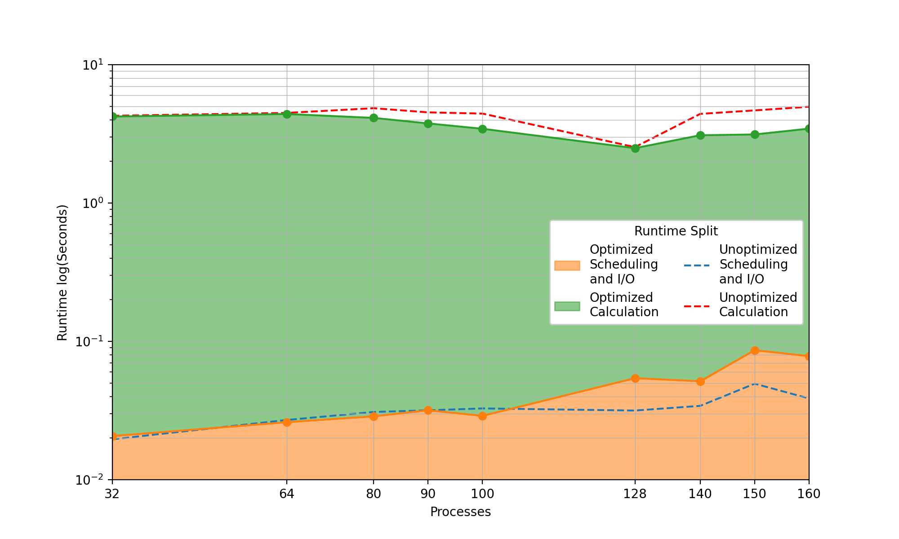

# Design

This document summarizes the design choices made to implement and optimize the Gaussian elimination parallel algorithm using Message Passing Interface (MPI). We will be using the [MPICH](https://www.mpich.org/) implementation and developing/testing the design choices in [Chameleon Cloud](https://www.chameleoncloud.org/). For more information on the hardware and testing environment for this program, please see the [README](https://github.com/isalva2/parallel-processing/blob/main/MPI/gaussian-elimination/README.md) file.

## Design Considerations and Requirements

From the analysis of the Gaussian elimination step, we can determine the requirements of implementing MPI for each iteration of the algorithm.

More formally, for the $i^{th}$ iteration of the algorithm, the following items are required:

1. The root (rank 0) process stores the $(i-1)^{th}$ iteration of matrix `A` and vector `B`.
2. All processes must be scheduled via static interleaving.
3. The worker processes must have the same $(i-1)^{th}$ iteration of `A` and `B`, or at the very least the $(i-1)^{th}$ row of `A` and `B`, and rows that correspond to there scheduling.
4. Once all computations by the root and worker processes are completed, the local copy of `A` and `B` stored by the root process must be updated.
5. After completion of the Gaussian elimination step, the back substitution phase occurs. This phase exhibits $O(N^2)$ time complexity (as opposed to the previous phase's $O(N^3)$ time complexity), and can therefore be computed serially by the root process.

We can now begin matching these requirements to the appropriate MPI routines for design implementation.

## Program Logic and Candidate MPI Routines

1. The root process will initialize inputs `A` and `B` of the program, and subsequent MPI routine calls will be originate from root.
2. The root process will assign tasks to itself and the worker processes using static interleaved scheduling.
3. Each worker process must receive copies of `A` and `B`. This is an example of one-to-all communication, and the `MPI_Bcast()` routine is a potential candidate for this task. To send the rows that each worker process will compute, one-to-one communication in the form of the blocking `MPI_Send()` or non-blocking `MPI_Isend()` routines must be used.
4. While the root process can perform the Gaussian elimination computations independent of MPI communications, the worker processes must wait on communication of the updated data. Due to this dependency, the blocking routine `MPI_Recv()` will be used to receive the data. Once worker computations are complete, a `MPI_Send()` or `MPI_Isend` will be used to transmit the updated values back to the root process.
5. Upon completion of this step, the algorithm will transition to the back substitution phase. These phases will be separated by an `MPI_Barrier()` to ensure synchronization and completion of the first phase.

## Code Structure

Please note that code snippets outlined in the rest of this document are paraphrased or adapted from the MPI program [`gauss-mpi.c`](https://github.com/isalva2/parallel-processing/blob/main/MPI/gaussian-elimination/gauss-mpi.c). Please refer to the actual program for further clarification on code structure, logic, implementation of MPI, and additional functionality not discussed in this documentation.

### Program Parameters and Global Variables

As previously stated, extensive modification to the source code was necessary to implement MPI. The modified program begins with initial header files and program parameters Necessary for MPI.

```c
#include <mpi.h>

/* MPI variables */
int numprocs, myid;
double start_time, stop_time;
```

The program begins with the inclusion of the `<mpi.h>` header file, which is necessary for compiling with the MPICH compiler `mpicc`. Next, integer variables `numprocs` and `myid` are declared for indexing, identification, and scheduling purposes. The double variables `start_time` and `stop_time` are declared and are used in conjunction with the `MPI_Wtime()` routine to log runtime performance of the program.

### `main()` Function Structure

In addition to the main parallelization tasks associated with MPI, another auxiliary goal of this is to achieve functional parity with the the source code, i.e., both command line outputs are more or less identical. These goals are evident in the structure of the program's `main()` function.

```c
int main(int argc, char *argv[])
{   
    // Initialize MPI environment and num processes and rank
    MPI_Init(&argc, &argv);
    MPI_Comm_size(MPI_COMM_WORLD, &numprocs);
    MPI_Comm_rank(MPI_COMM_WORLD, &myid);

    // Initialize parameters, everyone gets N
    parameters(argc, argv);

    // Initialize inputs and Start Clock
    if (myid == 0)
    {
        initialize_inputs();
        print_inputs();
        printf("\nStarting clock.\n");
        start_time = MPI_Wtime();
    }

    // Compute Gaussian elimination
    gauss_mpi();

    // Stop Clock and runtime logging
    if (myid == 0)
    {
        stop_time = MPI_Wtime();
        printf("Stopped clock.\n");
        print_X();
        printf("\nElapsed time = %f seconds\n", stop_time - start_time);
        printf("--------------------------------------------\n");
    }

    // Exit MPI environment
    MPI_Finalize();
    exit(0);
}
```

The program begins by initializing the MPI environment using `MPI_Init()`. The routine `MPI_Comm_size()` is then used to obtain the total number of processes used by the program (specified at runtime from the CLI), and `MPI_Comm_rank()` is used to obtain the rank of each process running the program. These integer values are stored in `numprocs` and `myid` respectively. It is important to note that these routines use the global communicator `MPI_COMM_WORLD`, the default communicator that makes use of every process.

Job size `N` and optional random seed are initialized using the `parameters()` function, and are specified at runtime. These actions are trivial in terms of time complexity and as such are completed by each process, with the additional bonus of transmitting the global variable `N` to each process.

The subsequent if statement is the first instance of using the rank of a process (`myid`) to perform a specific action. In this case, the root process initializes inputs usings `initialize_inputs`, generating initial values for `A`, `B`, and `X`. After this, the `start_time` of the gaussian elimination step is recorded using the `MPI_Wtime()` routine. In addition to MPI Communication techniques, the root process is also responsible for general serial tasks such as input/output and printing to the command line.

The gaussian elimination step is called using `gauss_mpi()`. Modifications to the program for runtime optimization were primarily made in this function.

The root process then records the execution `stop_time` of the Gaussian elimination step, and final command line outputs are sent to the command line.

Finally, the MPI Environment is closed using `MPI_finalize()` and the program is exited.

## Initial `gauss_mpi()` Function Design

Taking into account the design considerations and requirements of the previous section, an initial first attempt at the design of the function `gauss_mpi()` was developed from the original serial code's `gauss()` function.

```c
void gauss()
{
    int norm, row, col; /* Normalization row, and zeroing
                         * element row and col */
    float multiplier;

    printf("Computing Serially.\n");

    /* Gaussian elimination */
    for (norm = 0; norm < N - 1; norm++)
    {
        for (row = norm + 1; row < N; row++)
        {
            multiplier = A[row][norm] / A[norm][norm];
            for (col = norm; col < N; col++)
            {
                A[row][col] -= A[norm][col] * multiplier;
            }
            B[row] -= B[norm] * multiplier;
        }
    }
    /* (Diagonal elements are not normalized to 1.  This is treated in back
     * substitution.)
     */

    /* Back substitution */
    for (row = N - 1; row >= 0; row--)
    {
        X[row] = B[row];
        for (col = N - 1; col > row; col--)
        {
            X[row] -= A[row][col] * X[col];
        }
        X[row] /= A[row][row];
    }
}
```

And here is the MPI implementation:

```c
void gauss_mpi()
{
    int norm, row, col, proc;
    float multiplier;

    // Declare request and status arrays
    MPI_Request root_requests[2], worker_requests[2];
    MPI_Status root_statuses[2], worker_statuses[2];

    // Begin Gaussian Elimination
    for (norm = 0; norm < N - 1; norm++)
    {
        // Broadcast A and B to all workers
        MPI_Bcast(&A[norm][0], N, MPI_FLOAT, 0, MPI_COMM_WORLD);
        MPI_Bcast(&B[norm], 1, MPI_FLOAT, 0, MPI_COMM_WORLD);

        if (myid == 0) // Root
        {
            // Static interleave schedule rows of A to other processes
            for (proc = 1; proc < numprocs; proc++)
            {
                for (row = norm + 1 + proc; row < N; row += numprocs)
                {
                    MPI_Isend(&A[row], N, MPI_FLOAT, proc, 0, MPI_COMM_WORLD, &root_requests[0]);
                    MPI_Isend(&B[row], 1, MPI_FLOAT, proc, 0, MPI_COMM_WORLD, &root_requests[1]);
                    MPI_Waitall(2, root_requests, worker_statuses);
                }
            }

            // Root Gaussian elimination
            for (row = norm + 1; row < N; row += numprocs)
            {
                multiplier = A[row][norm] / A[norm][norm];
                for (col = norm; col < N; col++)
                {
                    A[row][col] -= A[norm][col] * multiplier;
                }
                B[row] -= B[norm] * multiplier;
            }
            // Receive updated A rows and B elements from other processes
            for (proc = 1; proc < numprocs; proc++)
            {
                for (row = norm + 1 + proc; row < N; row += numprocs)
                {
                    MPI_Recv(&A[row], N, MPI_FLOAT, proc, 1, MPI_COMM_WORLD, &root_statuses[0]);
                    MPI_Recv(&B[row], 1, MPI_FLOAT, proc, 1, MPI_COMM_WORLD, &root_statuses[1]);
                }
            }
        }
        else // Worker processes
        {
            // Perform worker Gaussian elimination
            for (row = norm + 1 + myid; row < N; row += numprocs)
            {
                MPI_Recv(&A[row], N, MPI_FLOAT, 0, 0, MPI_COMM_WORLD, &worker_statuses[0]);
                MPI_Recv(&B[row], 1, MPI_FLOAT, 0, 0, MPI_COMM_WORLD, &worker_statuses[1]);
                
                multiplier = A[row][norm] / A[norm][norm];
                for (col = norm; col < N; col++)
                {
                    A[row][col] -= A[norm][col] * multiplier;
                }
                B[row] -= B[norm] * multiplier;

                MPI_Isend(&A[row], N, MPI_FLOAT, 0, 1, MPI_COMM_WORLD, &worker_requests[0]);
                MPI_Isend(&B[row], 1, MPI_FLOAT, 0, 1, MPI_COMM_WORLD, &worker_requests[1]);
            }
        }
    }

    // Barrier before back substitution
    MPI_Barrier(MPI_COMM_WORLD);

    // Back substitution computed by root
    if (myid == 0)
    {
        for (row = N - 1; row >= 0; row--)
        {
            X[row] = B[row];
            for (col = N - 1; col > row; col--)
            {
                X[row] -= A[row][col] * X[col];
            }
            X[row] /= A[row][row];
        }
    }
}
```

### Function Overview

There's a lot going on here, so let's break it down into discrete steps:

1. Function initialization
2. Outer loop `norm` iteration and broadcasting
3. Inner loop root process scheduling
4. Gaussian elimination computation and send/receive communication
5. Back substitution phase

**1. Function Initialization**
The function begins with the declaration of variables `norm`, `row`, `col`, and `multiplier`, identical to the serial source code. An additional variable `proc` is declared, which will be used for process scheduling.

`MPI_Request` and `MPI_Status` arrays are then declared for the purposes of interprocess, point-to-point communication. The design choice of array objects wil be discussed in **Part 3.**

Initialization concludes with the a `MPI_Barrier()` call. This routine serves are the starting point for the Gaussian elimination step and ensures that all processes are synchronized. Note that this is a **collective call** routine, and therefore the global communicator `MPI_COMM_WORLD` is used. In fact, the entire scope of this program solely uses this communicator.

**2. Outer loop `norm` iteration and broadcasting**
The primary algorithmic steps of Gaussian elimination begin at the outer `norm` loop. This loop begins with two `MPI_Bcast()` calls, one for `A` and `B` respectively. The argument `&A[norm][0]` points to the address of the first element, of the "`norm`-th" row (the `norm=0` the first row), and the second argument `N` specifies the entire first row to be broadcasted. Similarly, the second broadcast call points towards the address of the first element of `B`, and the second argument specifies only the first element.

`MPI_Bcast()` also serves the purposes of an implicit barrier function, such that all processes are synchronized, and store the same values of `A` and `B` for the next outer loop iteration.

**3. Inner loop root process scheduling**
The inner loop operations consist of two if-else clauses that direct the tasks of the root and worker processes. While the worker processes primarily perform compute tasks, the root process is also responsible for additional scheduling and data movement management tasks. The first part of the root process clause is static interleaved assignment of data from the root process's copies of `A` and `B`.

The data assignment is encapsulated as a double for loop that iterates over all worker processes and there requisite rows/elements of `A` and `B`. The inner control statement `(row = norm + 1 + proc; row < N; row += numprocs)` utilizes the worker process's rank, `proc`, to index the rows that will be assigned to that process.

The `row` variable is then used in conjunction with two `MPI_Isend()` routines to send the necessary parts of `A` and `B` to the worker processes. `MPI_Isend()` was used instead of `MPI_Send()`, due to the non-blocking nature of the routine. This was design choice was made to increase message passing speed, and to allow for `B` to be sent without having to wait for `A`.Both send routines are accompanied by a single `MPI_Waitall()` routine, however initial design for this block is as follows:

```c
MPI_Isend(&A[row], N, MPI_FLOAT, proc, 0, MPI_COMM_WORLD, &request);
MPI_Wait(&request, &status);
MPI_Isend(&B[row], 1, MPI_FLOAT, proc, 0, MPI_COMM_WORLD, &request);
MPI_Wait(&request, &status);
```

This design, upon further inspection was deemed to be inefficient, as to wait routines would double the blocking time of the current implementation, and would defeat the purpose of using `MPI_Isend()`.

The use of a single wait for two send routines also facilitates the need for an array `MPI_Request` handle. The root process has it's own `root_request` array and complementary `worker_request` array, and the worker processes have similar vice-versa variables for communication back to the root process.

**4. Gaussian elimination computation and send/receive communication**
This step incorporates the most complex use of MPI so far, and is where the actual Gaussian elimination computations take place. Following point-to-point communication from the root process, two corresponding `MPI_Recv()` for `A` and `B` occur at each worker process. The first three arguments for both receive routines are identical to their `MPI_Isend()` counterparts, and both receive routines utilize the previously declared `MPI_Status` array `worker_statuses`.

The blocking `MPI_Recv()` routine was used for both `A` and `B` to ensure that every worker process has the correct, current copy of the data before computation. With all processes storing the same copy of the data, the actual Gaussian elimination computation can commence.

Following computation, the worker processes transmit their portions of computed `A` and `B` back to the root process in a similar manner as the initial data transmittal from the root process. The transmittal consists of a double for loop, where the process's rank `myid` is used to index the use of `MPI_Isend()`routines. These send routines are then received by the root process, which then updates it's copy of `A` and `B` for the next `norm` iteration.

It is interesting to note that both root and worker tasks exhibit a degree of `symmetry`. Both if-else clauses begin with a send/receive communications, perform calculations, and perform a second, final round of communication.

**5. Back substitution phase**
After all `norm` iterations are complete, a final `MPI_Barrier()` is called and the root process performs the back substitution step. This step competes the `gauss_mpi()` function which returns to main for final output and termination steps.

## Revised Design

Upon initial testing of the original `gauss_mpi()` function implementation, the program functioned correctly, and was mathematically equivalent to the serial version. However, at small workloads (`N < 1000`) the program did not appear to exhibit performance gains and at large workloads (`N > 3000`), performance severely degraded and would often hang from deadlock.

At the problem statement workload of `N = 5000`, a rough approximation of the number of messages sent would be for every `norm` iteration, the program will send `2*(N - norm)` messages. For the first iteration that would be 10,000 messages, and a conservative estimate, $\frac{2N(N-1)}{2}$, puts the lower bound of messages sent for this program at 12.5 million send/receive operations.

For context the serial program can perform the computation in approximately 136 seconds. It is apparent that communication costs are impacting performance, and it is imperative that subsequent design versions must minimize communication between processes.

For the next design, the following design requirements were subject to consideration:

1. Communication using MPI routines must be minimized.
2. Workload scheduling should be **static** and not dynamically assigned during calculation time. This requirement eliminates redundant, costly communication which hampered the initial design.

With these requirements in mind, the following, improved, `gauss_mpi()` function was developed:

```c
void gauss_mpi()
{
    // Algorithm variables
    int norm, row, col, proc;
    float multiplier;

    // Declare status object for MPI_Recv()
    MPI_Status status;

    // Begin static interleaved scheduling by root process
    if (myid == 0) 
    {
        for (row = 1; row < N - 1; row ++)
        {
            // Static assignment of rows to each worker process
            proc = row % numprocs;
            if (proc != 0)
            {
                // Send rows of A and corresponding value of B
                MPI_Send(&A[row + 1][0], N, MPI_FLOAT, proc, 0, MPI_COMM_WORLD);
                MPI_Send(&B[row + 1], 1, MPI_FLOAT, proc, 1, MPI_COMM_WORLD);
            }
            
        }
    }
    // Worker processes receive rows
    else
    {
        for(row = 1; row < N - 1; row++)
        {   
            if (myid == row % numprocs)
            {
                // Corresponding send and receives
                MPI_Recv(&A[row + 1][0], N, MPI_FLOAT, 0, 0, MPI_COMM_WORLD, &status);
                MPI_Recv(&B[row + 1], 1, MPI_FLOAT, 0, 1, MPI_COMM_WORLD, &status);
            }
        }
    }

    // Broadcast initial 0-th norm row
    MPI_Bcast(&A[0], N, MPI_FLOAT, 0, MPI_COMM_WORLD);
    MPI_Bcast(&B[0], 1, MPI_FLOAT, 0, MPI_COMM_WORLD);
    
    // Begin Gaussian elimination step
    for (norm = 0; norm < N - 1; norm++)
    {
        // New main calc using modulo
        for (row = norm + 1; row < N; row ++)
        {
            if (myid == (row - 1 + numprocs) % numprocs)
            {
                multiplier = A[row][norm] / A[norm][norm];
                for (col = norm; col < N; col++)
                {
                    A[row][col] -= A[norm][col] * multiplier;
                }
                B[row] -= B[norm] * multiplier;
            }
        }
        
        // norm-th proc broadcasts next, completed, norm + 1 row for next iteration
        proc = norm % numprocs;
        MPI_Bcast(&A[norm+1][0], N, MPI_FLOAT, proc, MPI_COMM_WORLD);
        MPI_Bcast(&B[norm+1], 1, MPI_FLOAT, proc, MPI_COMM_WORLD);

        MPI_Barrier(MPI_COMM_WORLD);
    }

    // Back substitution computer by root
    if (myid == 0)
    {
        for (row = N - 1; row >= 0; row--)
        {
            X[row] = B[row];
            for (col = N - 1; col > row; col--)
            {
                X[row] -= A[row][col] * X[col];
            }
            X[row] /= A[row][row];
        }
    }
}
```

Let's go step-by-step through this function:

1. **Function Initialization** Local variables and `MPI_Status` objects are declared similarly to the initial design of `gauss_mpi()`. Since `MPI_Isend()` is not used in this version, a single `MPI_Status` object can be used as opposed to an array.
2. **Process Scheduling** Assignment of rows is performed in a round-robin fashion, where each row is assigned a processor cyclically using the modulo operator `%` and the number of processes `numprocs`. For each worker process, the root process performs two `MPI_Send()` routines and corresponding `MPI_Recv()` for `A` and `B` respectively. Both send buffer arrays are indexed to the `row+1`*-th* column to account for the initial normalization row at `row = 0`, in essence beginning static scheduling at the second row of `A` where `row = 0`. Assignment concludes with a one-to-all `MPI_Bcast()` of the of the first `norm = 0` row of `A` and `B` for the first iteration of the Gaussian elimination step.
3. **Gaussian Elimination** The Gaussian elimination step begins at the first `norm` iteration, where rows of `A` are calculated by their respective process. Since the `norm % numproc`*-th* process calculates the row of `A` immediately after the `norm` row, that process then calls two `MPI_Bcast()` routines to send the newly calculated `norm + 1`*-th* row for the subsequent `norm + 1`*-th* iteration. This one-to-all communication per iteration also has the additional benefit of updating the root process's copies of `A` and `B`. This allows for no need for additional communication after the Gaussian elimination step.
4. **Back Substitution** The root process then completes the calculation by computing the back substitution step, identical to the previous design and the serial version of the algorithm.

## Experimental Results

The program was run on [Chameleon Cloud](https://www.chameleoncloud.org/) on a physical compute node with two Intel(R) Xeon(R) Platinum 8380 CPU's @ 2.30GHz. The node had 160 threads available, which was the primary experimental constraint for these initial results. Please see the [README](https://github.com/isalva2/parallel-processing/blob/main/MPI/gaussian-elimination/README.md) file for further details on the compute environment.

The parallel MPI program, `gauss-mpi,c`, was then evaluated for performance. In addition to the primary metrics of program runtime $T_p$ and speedup $S_p$, the scheduling, calculation, and Input/Output times were recorded to derive additional insight on the behavior of the program.

Below are the runtime results and speedup of the program for a workload of `N = 5000` and for a varying number of processes between $[1, 160]$. While the execution of these experimental runs were performed on a physical node with 80 cores, the number of processes that were available using MPI was 160. It appears then then that this MPI compute environment is constrained to the number of threads in the node.

<br>

| Processes |  Scheduling |  Calculation|   Input/Output | Total Runtime | Speedup |
|:--------:|:---------:|:--------:|:--------:|:---------:|:--------:|
|     1*    | -  | -| - | 136.245000|  1.0000  |
|     2    | 0.033389  | 62.511223| 0.000016 | 62.544628 |  2.1784  |
|     4    | 0.017588  | 31.407220| 0.000016 | 31.424824 |  4.3356  |
|     8    | 0.016505  | 15.870490| 0.000006 | 15.887000 |  8.5759  |
|    16    | 0.018768  | 8.153309 | 0.000008 | 8.172086  |  16.6720 |
|    32    | 0.019588  | 4.251714 | 0.000005 | 4.271306  |  31.8977 |
|    64    | 0.027006  | 4.453472 | 0.000008 | 4.480486  |  30.4085 |
|    80    | 0.030870  | 4.815225 | 0.000007 | 4.846102  |  28.1143 |
|    90    | 0.031736  | 4.490077 | 0.000004 | 4.521817  |  30.1306 |
|   100    | 0.032757  | 4.397681 | 0.000003 | 4.430441  |  30.7520 |
|   128    | 0.031620  | 2.503614 | 0.000001 | 2.535235  |  53.7406 |
|   130    | 0.054888  | 4.339068 | 0.000023 | 4.393980  |  31.0072 |
|   140    | 0.034187  | 4.374915 | 0.000005 | 4.409108  |  30.9008 |
|   150    | 0.049402  | 4.623055 | 0.000033 | 4.672489  |  29.1590 |
|   160    | 0.038593  | 4.927063 | 0.000067 | 4.965723  |  27.4371 |

*\*Serial computation evaluated using source gauss code*

Looking at the runtime split of the different phases of the program, it is apparent by the table of results and the log scale of the figure that the majority of runtime is attributed to the calculation of the Gaussian elimination step.

<br>
<p align="center">
  
</p>
<br>

As expected, calculation time decreases with an increase in number of processes, with a top performance of 2.53 seconds at `p = 128`. In general scheduling time increases with increasing `p`, and I/O time was constant and negligible for all program executions.

Another observation is that runtime plateaus at around 4.5 seconds with the exception of the top runtime at `p = 128`, then returning to sub-optimal performance at higher processes count. Additionally (and surprisingly), program executions at `p = 127` and `p = 129` still exhibited sub-optimal performance around 4.5 seconds, a near 2 second difference for +/- an additional process. It is unknown mechanism is contributing to this increase in performance, but an educated guess would be that either the compute node, the version of MPI, or some other combination of hardware and software is specially optimized or accelerated for 128 threads.

<br>
<p align="center">
  
</p>
<br>

Looking at speedup, the program exhibits linear speedup up to 32 processes. In fact, for processes between 4 and 16, the parallelization exhibited *super-linear* speedup, but could most likely be due to statistical variances on runtime, given how closely the experimental results follow the theoretical linear speedup.

<br>
<p align="center">
  
</p>
<br>

Looking at the full speedup graph up to `p = 180`, the optimized performance at `p = 128` is even more apparent, with a top speedup of 53.74, almost 2 times more than the prevailing sub-optimal speedup around 30.

## Optimization

Based on the experimental results, it's clear that further performance gains can be obtained by optimizing the calculation step of the program. Looking at the code for the calculation phase the only place that any optimization could occur is in the collective `MPI_Bcast()` calls.

```c
    for (norm = 0; norm < N - 1; norm++)
    {
        for (row = norm + 1; row < N; row ++)
        {
            if (myid == (row - 1 + numprocs) % numprocs)
            {
                multiplier = A[row][norm] / A[norm][norm];
                for (col = norm; col < N; col++)
                {
                    A[row][col] -= A[norm][col] * multiplier;
                }
                B[row] -= B[norm] * multiplier;
            }
        }
        proc = norm % numprocs;
        MPI_Bcast(&A[norm+1][0], N, MPI_FLOAT, proc, MPI_COMM_WORLD);
        MPI_Bcast(&B[norm+1], 1, MPI_FLOAT, proc, MPI_COMM_WORLD);
    }
    if (myid == 0)
    {
        for (row = N - 1; row >= 0; row--)
        {
            X[row] = B[row];
            for (col = N - 1; col > row; col--)
            {
                X[row] -= A[row][col] * X[col];
            }
            X[row] /= A[row][row];
        }
    }
```
There is some good intuition for this as well. As the Gaussian elimination algorithm results in a reduced upper triangle matrix, at `norm = 2500` approximately 50% of the buffer array will be redundant sends of `0.0`, and at the culmination of the algorithm at `norm = 4999`, only 0.02% of the buffer is used to send the last element of the last row of `A`.

With this idea in mind, modifications to the broadcast section of the code looks like this:

```c
        proc = norm % numprocs;
        MPI_Bcast(&A[norm+1][norm+1], N - norm - 1, MPI_FLOAT, proc, MPI_COMM_WORLD);
        MPI_Bcast(&B[norm+1], 1, MPI_FLOAT, proc, MPI_COMM_WORLD);
```

At the `norm`*-th* iteration, the buffer address of the first `MPI_Bcast()` is indexed at the row after the `norm` row, and at the next column in the algorithm. Upon further inspection of the calculation it appears we have exhausted the extent to which this algorithm can be optimized, given the problem statement requirements and available compute resources.

## Final Experimental Results

The optimized program was then experimentally validated against the same parameters as the The results of the optimized Gaussian elimination program exhibit succesful optimization of the original design:

| Processes |  Scheduling |  Calculation|   Input/Output | Total Runtime | Speedup |
|:--------:|:---------:|:--------:|:--------:|:---------:|:--------:|
| 1  | - | - | - | 136.245000 | 1.000000 |
| 2  | 0.033780 | 62.457058 | 0.000016 | 62.490854 | 2.180239 |
| 4  | 0.017332 | 31.356324 | 0.000018 | 31.373673 | 4.342654 |
| 8  | 0.017305 | 15.822196 | 0.000007 | 15.839509 | 8.601592 |
| 16 | 0.018694 | 8.084927 | 0.000008 | 8.103629 | 16.812838 |
| 32 | 0.020671 | 4.197893 | 0.000007 | 4.218571 | 32.296481 |
| 64 | 0.026027 | 4.375047 | 0.000021 | 4.401094 | 30.957076 |
| 80 | 0.028670 | 4.096097 | 0.000063 | 4.124831 | 33.030444 |
| 90 | 0.031784 | 3.730418 | 0.000003 | 3.762205 | 36.214135 |
| 100 | 0.028927 | 3.412251 | 0.000030 | 3.441207 | 39.592213 |
| 128 | 0.054222 | 2.437866 | 0.000005 | 2.492093 | 54.670913 |
| 140 | 0.051482 | 3.038696 | 0.000036 | 3.090213 | 44.089194 |
| 150 | 0.086400 | 3.044231 | 0.000020 | 3.130651 | 43.519702 |
| 160 | 0.078198 | 3.372274 | 0.000003 | 3.450475 | 39.485868 |

Performance metrics for the optimized design were initially similar to the original, but for larger processes sizes after `n < 32` the improvements from reduced `MPI_Bcast()` buffer sizes as apparent. Total runtime for the optimized design was consistently faster than the original, with the best runtime again at `p = 128`.

<br>
<p align="center">
  
</p>
<br>

Although total runtime and calculation splits were less than the unoptimized design, the total optimized scheduling and I/O (I/O contribution negligible) actually increased. This result is surprising given that modifications to the original design occurred only in the calculation phase of the code, therefore code for both scheduling routines are identical.

Speedup also sees an increases at `n > 64`, with consistent increase in speedup for all tested number of processes.

<br>
<p align="center">
  
</p>
<br>

As with the original design, top performance occurs at `n = 128` with a marginal increase from 53.7406 to 54.670913. Barring this outlier, increases in speedup at the upper range of processes span between 17.49% and 49.25%. From these metrics the optimization techniques implemented in this final design is justifiable and warranted.