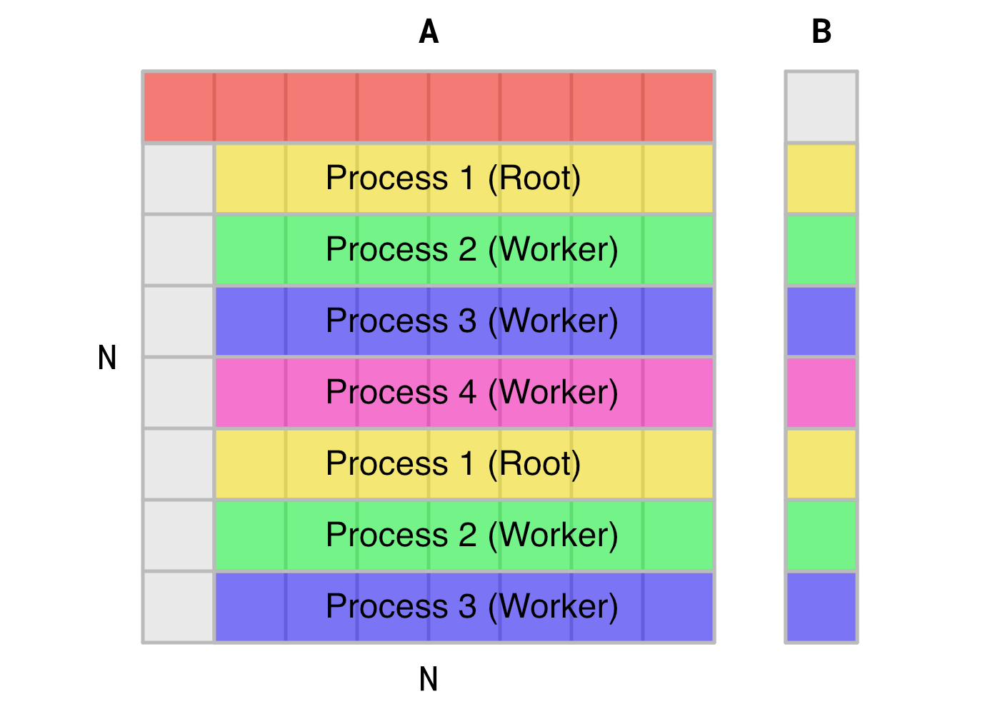
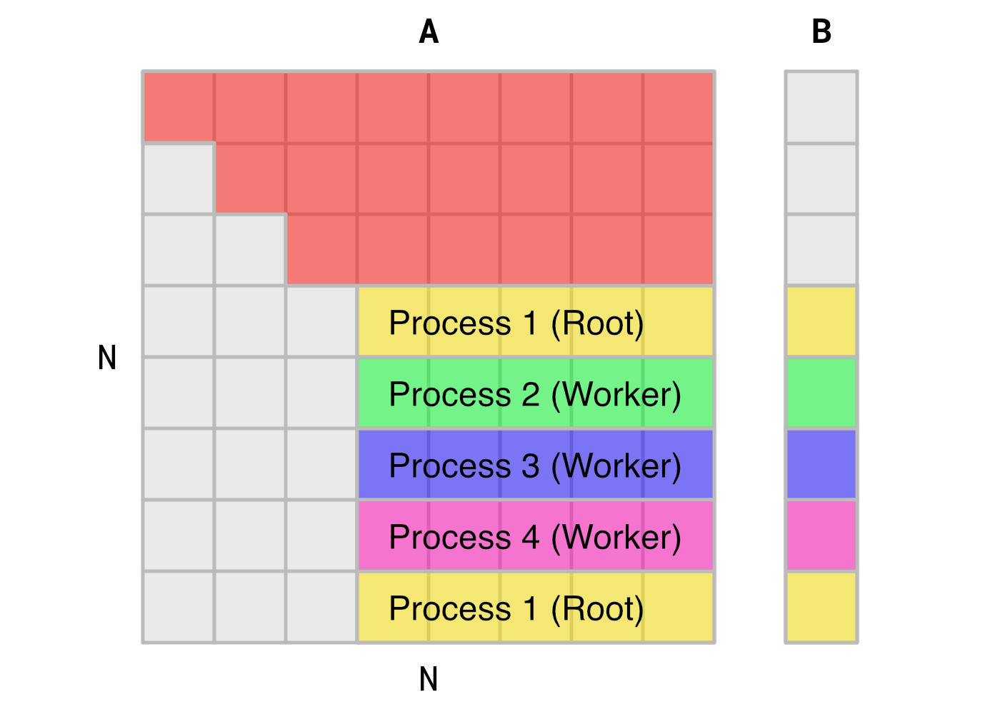

# Design

This document encompasses the design choices made to implement and optimize the Gaussian elimination parallel algorithm using Message Passing Interface (MPI). We will be using the [MPICH](https://www.mpich.org/) implementation and developing/testing on various Unix-like platforms. For information on the development and testing environment for this program, please see the `README` document.

## Algorithm Interpretation

As opposed to parallelization via `OpenMP` or `Pthreads`, the code structure and refactoring for an MPI program is far more explicit and requires a great deal of modification from source. While designing this program, a visualization of a small-scale example helped to gain some initial intuition for the implementation of MPI.

Suppose we wish to solve for matrix `A[8][8]` through Gaussian elimination. An MPI solution with four processes would therefore be initialized at `norm = 0` as illustrated in this figure:

<p align="center">

</p>


In this figure, the first row of `A` and the first element of `B` are **not modified**, but are used to compute the new values of the updated subarea of `A`, and the remaining elements of `B`. Rows of `A` and `B` are computed via **static interleaved scheduling**, where the second row of `A` and the second element of `B` are computed by the root processor, followed by the three other worker processes. Subsequent rows of the subarea are then assigned cyclically for each process, and computations of these rows are not dependent on one another, hence the application of parallelization and MPI.

The Gaussian elimination step repeats for 7 (`N-1`) iterations until an upper-triangular matrix is obtained for `A` and a corresponding updated `B`. This process is readily apparent in the following figure at the third (`norm = 2`) Gaussian elimination iteration:

<p align="center">

</p>

Note that static interleaved scheduling is still consistent on this iteration's subarea of `A`, and that the update computation on this subarea are contingent on the third row of `A`.

## Design Considerations and Requirements

From the analysis of the Gaussian elimination step, we can determine the requirements of implementing MPI for each iteration of the algorithm.

More formally, for the $i^{th}$ iteration of the algorithm, the following items are required:

1. The root (rank 0) process stores the $(i-1)^{th}$ iteration of matrix `A` and vector `B`.
2. All processes must be scheduled via static interleaving.
3. The worker processes must have the same $(i-1)^{th}$ iteration of `A` and `B`, or at the very least the $(i-1)^{th}$ row of `A` and `B`, and rows that correspond to there scheduling.
4. Once all computations by the root and worker processes are completed, the local copy of `A` and `B` stored by the root process must be updated.
5. After completion of the Gaussian elimination step, the back substitution phase occurs. This phase exhibits $O(N^2)$ time complexity (as opposed to the previous phase's $O(N^3)$ time complexity), and can therefore be computed serially by the root process.

We can now begin matching these requirements to the appropriate MPI routines for robust and mathematically sound implementation.

## Program Logic and Candidate MPI Routines

1. The root process will initialize inputs `A` and `B` of the program, and subsequent MPI routine calls will be originate from root.
2. The root process will assign tasks to itself and the worker processes using static interleaved scheduling.
3. Each worker process must receive copies of `A` and `B`. This is an example of one-to-all communication, and the `MPI_Bcast()` routine is a potential candidate for this task. To send the rows that each worker process will compute, one-to-one communication in the form of the blocking `MPI_Send()` or non-blocking `MPI_Isend()` routines must be used.
4. While the root process can perform the Gaussian elimination computations independent of MPI communications, the worker processes must wait on communication of the updated data. Due to this dependency, the blocking routine `MPI_Recv()` will be used to receive the data. Once worker computations are complete, a `MPI_Send()` or `MPI_Isend` will be used to transmit the updated values back to the root process.
5. Upon completion of this step, the algorithm will transition to the back substitution phase. These phases will be separated by an `MPI_Barrier()` to ensure synchronization and completion of the first phase.

## Code Structure

Please note that code snippets outlined in the rest of this document are paraphrased or adapted from the MPI program `gauss-mpi.c. Please refer to the actual program for further clarification on code structure, logic, implementation of MPI, and additional functionality not discussed in this documentation.

### Program Parameters and Global Variables

As previously stated, extensive modification to the source code was necessary to implement MPI. The modified program begins with initial header files and program parameters Necessary for MPI.

```c
#include <mpi.h>

/* MPI variables */
int numprocs, myid;
double start_time, stop_time;
```

The program begins with the inclusion of the `<mpi.h>` header file, which is necessary for compiling with the MPICH compiler `mpicc`. Next, integer variables `numprocs` and `myid` are declared for indexing, identification, and scheduling purposes. The double variables `start_time` and `stop_time` are declared and are used in conjunction with the `MPI_Wtime()` routine to log runtime performance of the program.

### `main()` Function Structure

In addition to the main parallelization tasks associated with MPI, another auxiliary goal of this is to achieve functional parity with the the source code, i.e., both command line outputs are more or less identical. These goals are evident in the structure of the program's `main()` function.

```c
int main(int argc, char *argv[])
{   
    // Initialize MPI environment and num processes and rank
    MPI_Init(&argc, &argv);
    MPI_Comm_size(MPI_COMM_WORLD, &numprocs);
    MPI_Comm_rank(MPI_COMM_WORLD, &myid);

    // Initialize parameters, everyone gets N
    parameters(argc, argv);

    // Initialize inputs and Start Clock
    if (myid == 0)
    {
        initialize_inputs();
        print_inputs();
        printf("\nStarting clock.\n");
        start_time = MPI_Wtime();
    }

    // Compute Gaussian elimination
    gauss_mpi();

    // Stop Clock and runtime logging
    if (myid == 0)
    {
        stop_time = MPI_Wtime();
        printf("Stopped clock.\n");
        print_X();
        printf("\nElapsed time = %f seconds\n", stop_time - start_time);
        printf("--------------------------------------------\n");
    }

    // Exit MPI environment
    MPI_Finalize();
    exit(0);
}
```

The program begins by initializing the MPI environment using `MPI_Init()`. The routine `MPI_Comm_size()` is then used to obtain the total number of processes used by the program (specified at runtime from the CLI), and `MPI_Comm_rank()` is used to obtain the rank of each process running the program. These integer values are stored in `numprocs` and `myid` respectively. It is important to note that these routines use the global communicator `MPI_COMM_WORLD`, the default communicator that makes use of every process.

Job size `N` and optional random seed are initialized using the `parameters()` function, and are specified at runtime. These actions are trivial in terms of time complexity and as such are completed by each process, with the additional bonus of transmitting the global variable `N` to each process.

The subsequent if statement is the first instance of using the rank of a process (`myid`) to perform a specific action. In this case, the root process initializes inputs usings `initialize_inputs`, generating initial values for `A`, `B`, and `X`. After this, the `start_time` of the gaussian elimination step is recorded using the `MPI_Wtime()` routine. In addition to MPI Communication techniques, the root process is also responsible for general serial tasks such as input/output and printing to the command line.

The gaussian elimination step is called using `gauss_mpi()`. Modifications to the program for runtime optimization were primarily made in this function.

The root process then records the execution `stop_time` of the Gaussian elimination step, and final command line outputs are sent to the command line.

Finally, the MPI Environment is closed using `MPI_finalize()` and the program is exited.

## Initial `gauss_mpi()` Function Design

Taking into account the design considerations and requirements of the previous section, an initial first attempt at the design of the function `gauss_mpi()` was developed from the original serial code's `gauss()` function.

```c
void gauss()
{
    int norm, row, col; /* Normalization row, and zeroing
                         * element row and col */
    float multiplier;

    printf("Computing Serially.\n");

    /* Gaussian elimination */
    for (norm = 0; norm < N - 1; norm++)
    {
        for (row = norm + 1; row < N; row++)
        {
            multiplier = A[row][norm] / A[norm][norm];
            for (col = norm; col < N; col++)
            {
                A[row][col] -= A[norm][col] * multiplier;
            }
            B[row] -= B[norm] * multiplier;
        }
    }
    /* (Diagonal elements are not normalized to 1.  This is treated in back
     * substitution.)
     */

    /* Back substitution */
    for (row = N - 1; row >= 0; row--)
    {
        X[row] = B[row];
        for (col = N - 1; col > row; col--)
        {
            X[row] -= A[row][col] * X[col];
        }
        X[row] /= A[row][row];
    }
}
```

And here is the MPI implementation:

```c
void gauss_mpi()
{
    int norm, row, col, proc;
    float multiplier;

    // Declare request and status arrays
    MPI_Request root_requests[2], worker_requests[2];
    MPI_Status root_statuses[2], worker_statuses[2];
    
    // synch up processes
    MPI_Barrier(MPI_COMM_WORLD);
    if (myid == 0)
    {
        printf("Computing in parallel with %d processes.\n", numprocs);
    }

    // Begin Gaussian Elimination
    for (norm = 0; norm < N - 1; norm++)
    {
        // Broadcast A and B to all workers
        MPI_Bcast(&A[norm][0], N, MPI_FLOAT, 0, MPI_COMM_WORLD);
        MPI_Bcast(&B[norm], 1, MPI_FLOAT, 0, MPI_COMM_WORLD);

        if (myid == 0) // Root
        {
            // Static interleave schedule rows of A to other processes
            for (proc = 1; proc < numprocs; proc++)
            {
                for (row = norm + 1 + proc; row < N; row += numprocs)
                {
                    MPI_Isend(&A[row], N, MPI_FLOAT, proc, 0, MPI_COMM_WORLD, &root_requests[0]);
                    MPI_Isend(&B[row], 1, MPI_FLOAT, proc, 0, MPI_COMM_WORLD, &root_requests[1]);
                    MPI_Waitall(2, root_requests, worker_statuses);
                }
            }

            // Root Gaussian elimination
            for (row = norm + 1; row < N; row += numprocs)
            {
                multiplier = A[row][norm] / A[norm][norm];
                for (col = norm; col < N; col++)
                {
                    A[row][col] -= A[norm][col] * multiplier;
                }
                B[row] -= B[norm] * multiplier;
            }
            // Receive updated A rows and B elements from other processes
            for (proc = 1; proc < numprocs; proc++)
            {
                for (row = norm + 1 + proc; row < N; row += numprocs)
                {
                    MPI_Recv(&A[row], N, MPI_FLOAT, proc, 1, MPI_COMM_WORLD, &root_statuses[0]);
                    MPI_Recv(&B[row], 1, MPI_FLOAT, proc, 1, MPI_COMM_WORLD, &root_statuses[1]);
                }
            }
        }
        else // Worker processes
        {
            // Perform worker Gaussian elimination
            for (row = norm + 1 + myid; row < N; row += numprocs)
            {
                MPI_Recv(&A[row], N, MPI_FLOAT, 0, 0, MPI_COMM_WORLD, &worker_statuses[0]);
                MPI_Recv(&B[row], 1, MPI_FLOAT, 0, 0, MPI_COMM_WORLD, &worker_statuses[1]);
                
                multiplier = A[row][norm] / A[norm][norm];
                for (col = norm; col < N; col++)
                {
                    A[row][col] -= A[norm][col] * multiplier;
                }
                B[row] -= B[norm] * multiplier;

                MPI_Isend(&A[row], N, MPI_FLOAT, 0, 1, MPI_COMM_WORLD, &worker_requests[0]);
                MPI_Isend(&B[row], 1, MPI_FLOAT, 0, 1, MPI_COMM_WORLD, &worker_requests[1]);
            }
        }
    }

    // Barrier before back substitution
    MPI_Barrier(MPI_COMM_WORLD);

    // Back substitution computed by root
    if (myid == 0)
    {
        for (row = N - 1; row >= 0; row--)
        {
            X[row] = B[row];
            for (col = N - 1; col > row; col--)
            {
                X[row] -= A[row][col] * X[col];
            }
            X[row] /= A[row][row];
        }
    }
}
```

### Function Overview

There's a lot going on here, so let's break it down into discrete steps:

1. Function initialization
2. Outer loop `norm` iteration and broadcasting
3. Inner loop root process scheduling
4. Gaussian elimination computation and send/receive communication
5. Back substitution phase

**1. Function Initialization**
The function begins with the declaration of variables `norm`, `row`, `col`, and `multiplier`, identical to the serial source code. An additional variable `proc` is declared, which will be used for process scheduling.

`MPI_Request` and `MPI_Status` arrays are then declared for the purposes of interprocess, point-to-point communication. The design choice of array objects wil be discussed in **Part 3.**

Initialization concludes with the a `MPI_Barrier()` call. This routine serves are the starting point for the Gaussian elimination step and ensures that all processes are synchronized. Note that this is a **collective call** routine, and therefore the global communicator `MPI_COMM_WORLD` is used. In fact, the entire scope of this program solely uses this communicator.

**2. Outer loop `norm` iteration and broadcasting**
The primary algorithmic steps of Gaussian elimination begin at the outer `norm` loop. This loop begins with two `MPI_Bcast()` calls, one for `A` and `B` respectively. The argument `&A[norm][0]` points to the address of the first element, of the "`norm`-th" row (the `norm=0` the first row), and the second argument `N` specifies the entire first row to be broadcasted. Similarly, the second broadcast call points towards the address of the first element of `B`, and the second argument specifies only the first element.

`MPI_Bcast()` also serves the purposes of an implicit barrier function, such that all processes are synchronized, and store the same values of `A` and `B` for the next outer loop iteration.

**3. Inner loop root process scheduling**
The inner loop operations consist of two if-else clauses that direct the tasks of the root and worker processes. While the worker processes primarily perform compute tasks, the root process is also responsible for additional scheduling and data movement management tasks. The first part of the root process clause is static interleaved assignment of data from the root process's copies of `A` and `B`.

The data assignment is encapsulated as a double for loop that iterates over all worker processes and there requisite rows/elements of `A` and `B`. The inner control statement `(row = norm + 1 + proc; row < N; row += numprocs)` utilizes the worker process's rank, `proc`, to index the rows that will be assigned to that process.

The `row` variable is then used in conjunction with two `MPI_Isend()` routines to send the necessary parts of `A` and `B` to the worker processes. `MPI_Isend()` was used instead of `MPI_Send()`, due to the non-blocking nature of the routine. This was design choice was made to increase message passing speed, and to allow for `B` to be sent without having to wait for `A`.Both send routines are accompanied by a single `MPI_Waitall()` routine, however initial design for this block is as follows:

```c
MPI_Isend(&A[row], N, MPI_FLOAT, proc, 0, MPI_COMM_WORLD, &request);
MPI_Wait(&request, &status);
MPI_Isend(&B[row], 1, MPI_FLOAT, proc, 0, MPI_COMM_WORLD, &request);
MPI_Wait(&request, &status);
```

This design, upon further inspection was deemed to be inefficient, as to wait routines would double the blocking time of the current implementation, and would defeat the purpose of using `MPI_Isend()`.

The use of a single wait for two send routines also facilitates the need for an array `MPI_Request` handle. The root process has it's own `root_request` array and complementary `worker_request` array, and the worker processes have similar vice-versa variables for communication back to the root process.

**4. Gaussian elimination computation and send/receive communication**
This step incorporates the most complex use of MPI so far, and is where the actual Gaussian elimination computations take place. Following point-to-point communication from the root process, two corresponding `MPI_Recv()` for `A` and `B` occur at each worker process. The first three arguments for both receive routines are identical to their `MPI_Isend()` counterparts, and both receive routines utilize the previously declared `MPI_Status` array `worker_statuses`.

The blocking `MPI_Recv()` routine was used for both `A` and `B` to ensure that every worker process has the correct, current copy of the data before computation. With all processes storing the same copy of the data, the actual Gaussian elimination computation can commence.

Following computation, the worker processes transmit their portions of computed `A` and `B` back to the root process in a similar manner as the initial data transmittal from the root process. The transmittal consists of a double for loop, where the process's rank `myid` is used to index the use of `MPI_Isend()`routines. These send routines are then received by the root process, which then updates it's copy of `A` and `B` for the next `norm` iteration.

It is interesting to note that both root and worker tasks exhibit a degree of `symmetry`. Both if-else clauses begin with a send/receive communications, perform calculations, and perform a second, final round of communication.

**5. Back substitution phase**
After all `norm` iterations are complete, a final `MPI_Barrier()` is called and the root process performs the back substitution step. This step competes the `gauss_mpi()` function which returns to main for final output and termination steps.

## Experimental Results

